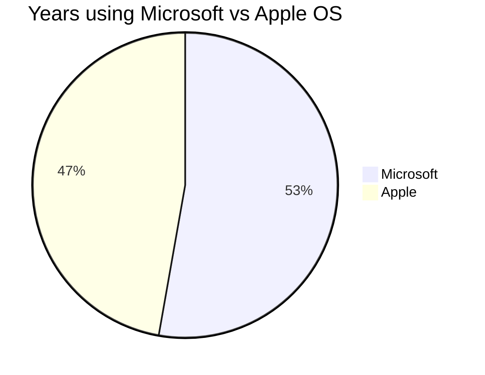

## Opening Statement

I rely on my desktop operating system for both work and daily tasks. Whether it’s managing projects, developing websites, or handling design work, having a reliable OS is essential for staying productive and efficient. It’s the backbone of everything I do, helping me manage multiple workflows without interruption.

## Windows and Apple Desktop Operating System Versions I Have Used

In the order of which I was introduced:

| No. | Name | Codename | Est. Duration
|---|---|---|---|
| 1. | MS-DOS 7 | | 4-5y (1995-1999)
| 2. | Windows 95 | Chicago | 6-7y (1995-2001)
| 3. | Windows 98 | Memphis | 2-3y (1999-2001)
| 4. | Windows XP | Whistler | 5-6y (2001-2006)
| 5. | OSX 10.3 | Panther | <1y (2004)
| 6. | Windows XP x64 | Anvil | 3-4y (2006-2009)
| 7. | Windows Vista | Longhorn | <1y (2007)
| 8. | OSX 10.5 | Leopard | <1y (2008)
| 9. | OSX 10.6 | Snow Leopard | 4-5y (2008-2012)
| 10. | Windows 7 | | 5-6y (2009-2014)
| 11. | Windows 8 | | <1y (2012)
| 12. | OSX 10.10 | Yosemite | 1y (2014)
| 13. | OSX 10.11 | El Capitan | 1y (2015)
| 14. | macOS 10.12 | Sierra | 1y (2016)
| 15. | macOS 10.13 | High Sierra | 1y (2017)
| 16. | macOS 10.14 | Mojave | 1y (2018)
| 17. | macOS 10.15 | Catalina | 1y (2019)
| 18. | macOS 11 | Big Sur | 1y (2020)
| 19. | macOS 12 | Monterey| 1y (2021-2024)
| 20. | Windows 11 | Sun Valley 2 | <1y (2024)

The table and chart above show that I’m pretty agnostic when it comes to desktop operating systems. But even so, there are some pros and cons for each one that are worth pointing out.

## Same Tool, Different Experiences

From my experience, one of the key differences between Windows and macOS is how each handles customization. Windows gives you almost endless possibilities to configure your setup, whether that’s tweaking settings or building a custom machine from the ground up. This flexibility works well for developers like me who enjoy fine-tuning things, especially when setting up environments for Ruby, Ruby on Rails, or even WordPress. However, I can see how it might feel overwhelming for users who don’t need or want this level of control. In contrast, macOS keeps things much more streamlined. While it doesn’t offer the same level of hardware or software customization, the tight integration between the two ensures a smooth and reliable experience, which is something I appreciate, especially when focusing on UI/UX design or digital solutions consulting.

When it comes to software, Windows offers a vast ecosystem that’s hard to match. It’s the go-to platform for businesses, gaming, and general versatility, which can be useful in web development if you’re looking to run multiple types of development tools. That said, its openness does come with the trade-off of being more vulnerable to security threats, so maintaining a secure environment, especially when dealing with client data, can feel like a bit of a chore. On the other hand, macOS is well-suited for creative fields like design, video editing, and music production, and it provides a secure and stable platform for coding and web development too. For projects involving Ruby or Rails, I’ve found that macOS integrates nicely with Unix-based tools, making it a solid choice for backend development.

Price is another major consideration. Windows devices come in all price ranges, which can be great if you’re looking for a budget-friendly option or a high-end machine with powerful specs for heavy development tasks. But with that variety comes inconsistency—some lower-end models don’t perform as well under the demands of web development, especially if you’re running resource-heavy environments. macOS, while significantly more expensive, offers consistent quality across the board. And if you’re invested in the Apple ecosystem, the seamless integration between Mac, iPhone, and iPad can really streamline your workflow, especially for those of us working across design, development, and consulting.

All in all, both systems handle my web development tasks, UI/UX work, and consulting needs just fine. They each have their own strengths, depending on what you’re looking for in a machine—whether that’s flexibility with Windows or the smooth, integrated experience of macOS.

## Other Notable Mentions

### Linux

I first came across Linux around the year 2000. I’ve tried various Linux distros over the years, but none have fully met my overall needs. That said, if I had to switch to Linux as my daily driver, I’m confident I’d manage! While I prefer stable distros like Ubuntu or Fedora, I’m also interested in trying out the likes of [ElementaryOS](https://elementary.io) or [Pop!_OS](https://pop.system76.com).

## ChromeOS

Honestly, ChromeOS feels like the dream setup—if it weren’t for all the extra Google bloat. It’s super lightweight, fast, and stays out of the way so you can focus on what you're doing. I love how quick it boots up, and it’s ideal for someone like me who spends most of their time in a browser. No fuss, no distractions, just a clean, efficient system.

The catch? It’s tightly tied to Google’s ecosystem, and that means dealing with all their services and extras, which can feel a bit much at times. Don’t get me wrong—it’s great if you're all-in on Google, but it often ends up feeling cluttered to me. If ChromeOS could keep that simplicity without the Google baggage, it’d be the perfect OS for anyone looking for a smooth, no-nonsense experience.

The Challenges of Switching and Balancing Multiple Operating Systems

One of the hardest parts of my workflow has been migrating between Windows and macOS every few years. Each system has its quirks, and getting used to them after a long period on the other is a frustrating process. Settings, interfaces, and even the way I manage files feel completely different, forcing me to spend time learning instead of working. The reconfiguration needed for my development tools and adjusting to how each OS handles updates or installations is time-consuming, and it interrupts the flow of my projects.

The bigger challenge, though, is using both operating systems simultaneously. Juggling two systems means constantly shifting mindsets—one moment I’m adjusting to macOS’s simplicity, the next I’m navigating Windows’ flexibility. Keeping workflows consistent and ensuring compatibility across both is not easy. Tasks like syncing project files, maintaining development environments, and even dealing with cross-platform apps can complicate my day-to-day work. The mental strain of adapting to two different systems, each with its own rhythm, adds to the challenge of staying productive.

## Which One Should I Choose?

Like many people, I use whatever is required of the task in hand. If you still can’t decide from the flowchart above, feel free to ring me up for a consultation session! 😆
