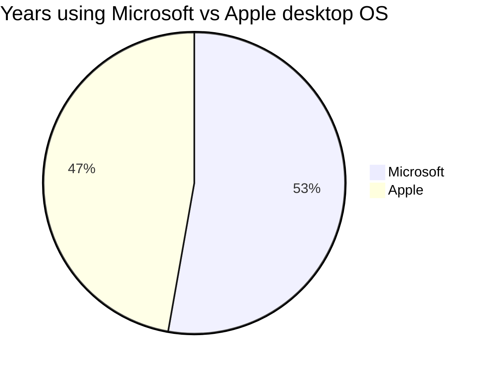

## Opening Statement

I rely on destop operating system for work and my day-to-day tasks.

## Windows and Apple Desktop Operating System Versions I Have Used

In the order of which I was introduced:

| No. | Name | Codename | Est. Duration
|---|---|---|---|
| 1. | MS-DOS 7 | | 4-5y (1995-1999)
| 2. | Windows 95 | Chicago | 6-7y (1995-2001)
| 3. | Windows 98 | Memphis | 2-3y (1999-2001)
| 4. | Windows XP | Whistler | 5-6y (2001-2006)
| 5. | OSX 10.3 | Panther | <1y (2004)
| 6. | Windows XP x64 | Anvil | 3-4y (2006-2009)
| 7. | Windows Vista | Longhorn | <1y (2007)
| 8. | OSX 10.5 | Leopard | <1y (2008)
| 9. | OSX 10.6 | Snow Leopard | 4-5y (2008-2012)
| 10. | Windows 7 | | 5-6y (2009-2014)
| 11. | Windows 8 | | <1y (2012)
| 12. | OSX 10.10 | Yosemite | 1y (2014)
| 13. | OSX 10.11 | El Capitan | 1y (2015)
| 14. | macOS 10.12 | Sierra | 1y (2016)
| 15. | macOS 10.13 | High Sierra | 1y (2017)
| 16. | macOS 10.14 | Mojave | 1y (2018)
| 17. | macOS 10.15 | Catalina | 1y (2019)
| 18. | macOS 11 | Big Sur | 1y (2020)
| 19. | macOS 12 | Monterey| 1y (2021-2024)
| 20. | Windows 11 | Sun Valley 2 | <1y (2024)

The table and chart above shows that I am desktop OS agnostic. However, there are notable pros and cons of each OS that I want to highlight.

## Other Notable Mentions

### Linux

I first stumbled upon Linux sometime around the year 2000. I have tried various flavours of Linux distros, however none seems to fit my overall needs. That being said, if I have to switch to Linux for my daily driver, I bet I can survive! Tho I would prefer to use stable distros such as Ubuntu or Fedora, I am also keen to try the likes of [ElementaryOS](https://elementary.io) or [Pop!_OS](https://pop.system76.com).

## ChromeOS

This is actually the dream, minus the bloat codes from Google.

## Which One Should I Choose?

If you still can't decide from the flowchart above, ring me up!
