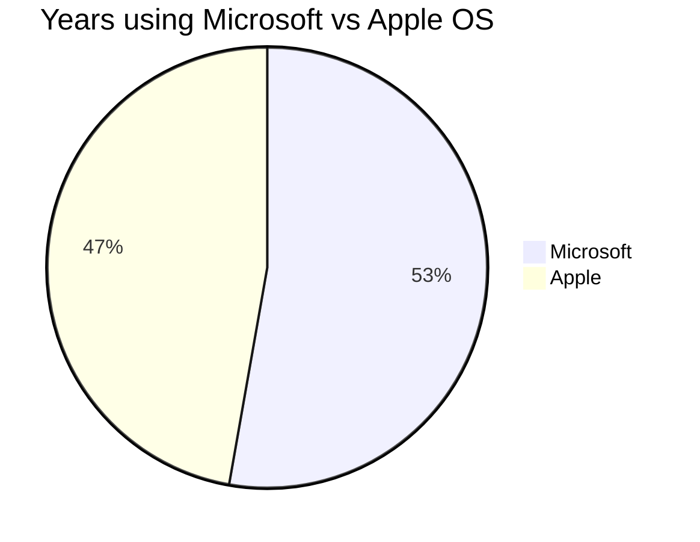

## Opening Statement

I rely on destop operating system for work and my day-to-day tasks.

## Windows and Apple Desktop Operating System Versions I Have Used

In the order of which I was introduced:

| No. | Name | Codename | Est. Duration
|---|---|---|---|
| 1. | MS-DOS 7 | | 4-5y (1995-1999)
| 2. | Windows 95 | Chicago | 6-7y (1995-2001)
| 3. | Windows 98 | Memphis | 2-3y (1999-2001)
| 4. | Windows XP | Whistler | 5-6y (2001-2006)
| 5. | OSX 10.3 | Panther | <1y (2004)
| 6. | Windows XP x64 | Anvil | 3-4y (2006-2009)
| 7. | Windows Vista | Longhorn | <1y (2007)
| 8. | OSX 10.5 | Leopard | <1y (2008)
| 9. | OSX 10.6 | Snow Leopard | 4-5y (2008-2012)
| 10. | Windows 7 | | 5-6y (2009-2014)
| 11. | Windows 8 | | <1y (2012)
| 12. | OSX 10.10 | Yosemite | 1y (2014)
| 13. | OSX 10.11 | El Capitan | 1y (2015)
| 14. | macOS 10.12 | Sierra | 1y (2016)
| 15. | macOS 10.13 | High Sierra | 1y (2017)
| 16. | macOS 10.14 | Mojave | 1y (2018)
| 17. | macOS 10.15 | Catalina | 1y (2019)
| 18. | macOS 11 | Big Sur | 1y (2020)
| 19. | macOS 12 | Monterey| 1y (2021-2024)
| 20. | Windows 11 | Sun Valley 2 | <1y (2024)

The table and chart above show that I’m pretty agnostic when it comes to desktop operating systems. But even so, there are some pros and cons for each one that are worth pointing out.

## Same Tool, Different Experiences

From my experience, one of the main differences between Windows and macOS is the level of customization. Windows lets you shape the system however you like—whether it’s tweaking settings or even building your own machine. This flexibility is great for someone like me, who enjoys tailoring hardware and software, but I can see how it might be overwhelming for the average user. On the flip side, macOS keeps things simple and clean. Apple’s tight control over hardware and software limits customization, but it delivers a smooth, reliable experience.

In terms of software, Windows has the upper hand with its wide range of apps, making it ideal for businesses, gaming, and general use. However, I’ve noticed that this openness comes at a price—Windows is more prone to malware, and keeping it secure can be a chore. macOS, on the other hand, shines in creative fields like video editing and music production. It’s secure, stable, and optimized for these tasks, but the options outside that space are a bit limited. If you're not into gaming or creative tools, you might find it restrictive.

Then there’s the issue of price and the overall ecosystem. Windows devices come in every shape and budget, but the quality can vary a lot. I’ve seen some high-end PCs perform brilliantly, but cheaper models often lead to frustration. macOS devices, while expensive, are consistently high quality. And if you’re already part of the Apple ecosystem, the seamless integration between Mac, iPhone, and iPad is a big plus. But if you’re not an Apple user, it can feel like you’re stuck inside a walled garden. That said, both systems are perfectly capable of handling my daily tasks straight out of the box.

## Other Notable Mentions

### Linux

I first came across Linux around the year 2000. I’ve tried various Linux distros over the years, but none have fully met my overall needs. That said, if I had to switch to Linux as my daily driver, I’m confident I’d manage! While I prefer stable distros like Ubuntu or Fedora, I’m also interested in trying out the likes of [ElementaryOS](https://elementary.io) or [Pop!_OS](https://pop.system76.com).

## ChromeOS

Honestly, ChromeOS feels like the dream setup—if it weren’t for all the extra Google bloat. It’s super lightweight, fast, and stays out of the way so you can focus on what you're doing. I love how quick it boots up, and it’s ideal for someone like me who spends most of their time in a browser. No fuss, no distractions, just a clean, efficient system.

The catch? It’s tightly tied to Google’s ecosystem, and that means dealing with all their services and extras, which can feel a bit much at times. Don’t get me wrong—it’s great if you're all-in on Google, but it often ends up feeling cluttered to me. If ChromeOS could keep that simplicity without the Google baggage, it’d be the perfect OS for anyone looking for a smooth, no-nonsense experience.

## Which One Should I Choose?

If you still can’t decide from the flowchart above, feel free to ring me up!
