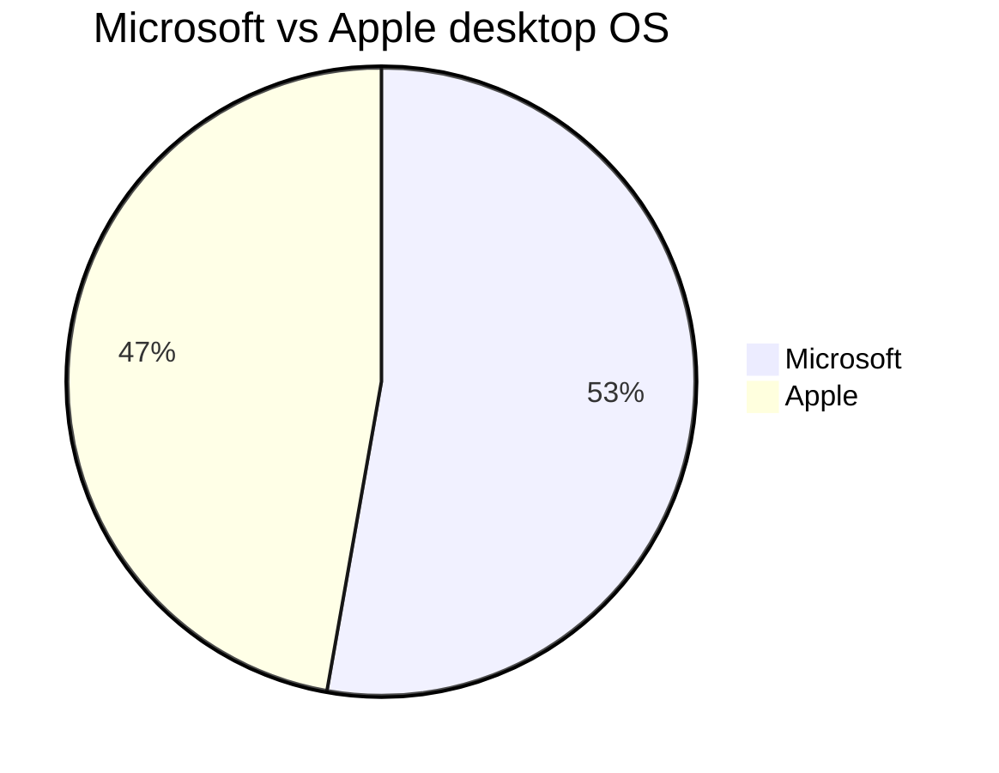

## Opening Statement

I rely on destop operating system for work and my day-to-day tasks.

## Windows and Apple Desktop Operating System Versions I Have Used

In the order of which I was introduced:

| No. | Name | Codename | Est. Duration
|---|---|---|---|
| 1. | MS-DOS 7 | | 4-5y (1995-1999)
| 2. | Windows 95 | Chicago | 6-7y (1995-2001)
| 3. | Windows 98 | Memphis | 2-3y (1999-2001)
| 4. | Windows XP | Whistler | 5-6y (2001-2006)
| 5. | OSX 10.3 | Panther | <1y (2004)
| 6. | Windows XP x64 | Anvil | 3-4y (2006-2009)
| 7. | Windows Vista | Longhorn | <1y (2007)
| 8. | OSX 10.5 | Leopard | <1y (2008)
| 9. | OSX 10.6 | Snow Leopard | 4-5y (2008-2012)
| 10. | Windows 7 | | 5-6y (2009-2014)
| 11. | Windows 8 | | <1y (2012)
| 12. | OSX 10.10 | Yosemite | 1y (2014)
| 13. | OSX 10.11 | El Capitan | 1y (2015)
| 14. | macOS 10.12 | Sierra | 1y (2016)
| 15. | macOS 10.13 | High Sierra | 1y (2017)
| 16. | macOS 10.14 | Mojave | 1y (2018)
| 17. | macOS 10.15 | Catalina | 1y (2019)
| 18. | macOS 11 | Big Sur | 1y (2020)
| 19. | macOS 12 | Monterey| 1y (2021-2024)
| 20. | Windows 11 | Sun Valley 2 | <1y (2024)

The table and chart above shows that I am desktop OS agnostic. However, there are notable pros and cons of each OS that I want to highlight.

## Windows OS

Comparing the pros and cons of Windows OS and macOS over the past 20 years reveals how each system has evolved and catered to different user needs and preferences. Here's a detailed look:

### Pros:
1. **Widespread Use and Compatibility**: 
   - **Hardware Compatibility**: Windows OS has historically supported a wide range of hardware configurations from numerous manufacturers, offering users flexibility in choosing or building their own systems.
   - **Software Availability**: Most software, especially enterprise and gaming applications, are designed with Windows compatibility in mind.

2. **Customization and Flexibility**: 
   - **Customization Options**: Windows allows extensive customization of both software and hardware, appealing to power users and gamers.
   - **Backward Compatibility**: Windows has maintained backward compatibility, ensuring that older software can still run on newer versions of the OS.

3. **Enterprise Integration**:
   - **Enterprise Features**: Windows offers robust features for enterprise environments, including Active Directory integration, group policy management, and enterprise-level security solutions.
   - **Office Suite**: Microsoft Office is deeply integrated and optimized for Windows, which is crucial for business users.

4. **Gaming**:
   - **Gaming Support**: Windows is the preferred OS for gamers due to its compatibility with a vast array of games and support for the latest gaming hardware and software innovations.

### Cons:
1. **Security Vulnerabilities**:
   - **Target for Malware**: Due to its widespread use, Windows is a common target for viruses and malware, necessitating robust security measures.
   
2. **System Stability**:
   - **Bloatware**: OEM versions of Windows often come with pre-installed bloatware, which can affect system performance.
   - **Fragmentation**: The broad hardware support can sometimes lead to driver conflicts and system instability.

3. **Cost**:
   - **License Costs**: Windows licenses can be expensive, particularly for enterprise users who require volume licensing.

## macOS

### Pros:
1. **User Experience**:
   - **User Interface**: macOS is known for its sleek, user-friendly interface and seamless user experience, which is consistent across Apple devices.
   - **Quality of Applications**: Many creative and professional software applications (e.g., Final Cut Pro, Logic Pro) are optimized for macOS.

2. **Security**:
   - **Built-in Security**: macOS is generally considered more secure against malware and viruses due to its Unix-based architecture and Apple's rigorous security protocols.

3. **Integration with Apple Ecosystem**:
   - **Ecosystem Synergy**: macOS offers excellent integration with other Apple devices, such as iPhones, iPads, and Apple Watches, enhancing productivity and convenience through features like Handoff, AirDrop, and Continuity.

4. **Stability and Performance**:
   - **Optimized Hardware and Software**: Apple’s control over both hardware and software results in a highly optimized and stable system, with less risk of driver conflicts and system crashes.

### Cons:
1. **Cost**:
   - **High Initial Cost**: Macs tend to be more expensive than their Windows counterparts, which can be a barrier for many users.
   - **Limited Customization**: Hardware customization options are limited, often requiring users to pay a premium for upgrades.

2. **Software Compatibility**:
   - **Limited Software Availability**: Some software, especially specialized enterprise and gaming applications, may not be available or optimized for macOS.
   - **Gaming**: macOS is not a primary choice for gamers due to limited game availability and less robust gaming hardware support.

3. **Hardware Choices**:
   - **Limited Hardware Options**: Users have fewer choices in terms of hardware specifications and models compared to the vast array of Windows-compatible devices.

## Summary

**Windows OS** has evolved to offer extensive hardware and software compatibility, making it ideal for a wide range of users, from gamers to enterprise professionals. However, it is more susceptible to security threats and system instability due to its open nature.

**macOS** provides a premium, stable, and secure user experience with deep integration into the Apple ecosystem, making it a preferred choice for creative professionals and users who value seamless device interoperability. The main drawbacks are its high cost and limited hardware and software customization options.

Choosing between Windows OS and macOS largely depends on individual needs, preferences, and budget considerations.

## Other Notable Mentions

### Linux

I first stumbled upon Linux sometime around the year 2000. I have tried various flavours of Linux distros, however none seems to fit my overall needs. That being said, if I have to switch to Linux for my daily driver, I bet I can survive! Tho I would prefer to use stable distros such as Ubuntu or Fedora, I am also keen to try the likes of [ElementaryOS](https://elementary.io) or [Pop!_OS](https://pop.system76.com). Or settle with Arch. 

## ChromeOS

This is actually the dream, minus the bloat codes from Google.

## Which One Should I Choose?

According to ChatGPT:

**Windows OS** has evolved to offer extensive hardware and software compatibility, making it ideal for a wide range of users, from gamers to enterprise professionals. However, it is more susceptible to security threats and system instability due to its open nature.

**macOS** provides a premium, stable, and secure user experience with deep integration into the Apple ecosystem, making it a preferred choice for creative professionals and users who value seamless device interoperability. The main drawbacks are its high cost and limited hardware and software customization options.

If you still can't decide, ring me up!
