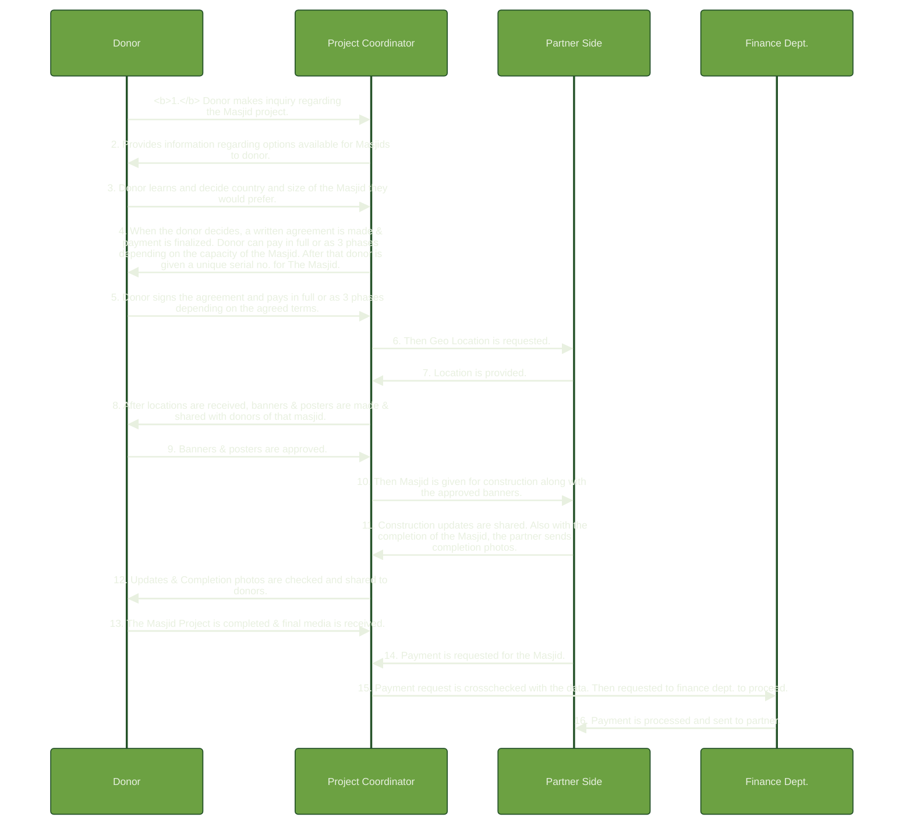

> Quick guide to setup and configure MermaidJS for websites.

## This code...


```php
%%{
    init: {
        'theme': 'base',
        'wrap': true,
        'fontSize': 10,
        'themeVariables': {
            'darkMode': false,
            'primaryColor': '#6CA142',
            'primaryTextColor': '#E8F0E0',
            'primaryBorderColor': '#245228',
            'lineColor': '#F8B229',
            'secondaryColor': '#006100',
            'tertiaryColor': '#fff',
            'signalColor': '#E8F0E0'
        }
    }
}%%

sequenceDiagram
    Donor->>Project Coordinator: 1. Donor makes inquiry regarding the Masjid project.
    Project Coordinator->>Donor: 2. Provides information regarding options available for Masjids to donor.
    Donor->>Project Coordinator: 3. Donor learns and decide country and size of the Masjid they would prefer.
    Project Coordinator->>Donor: 4. When the donor decides, a written agreement is made & payment is finalized. Donor can pay in full or as 3 phases depending on the capacity of the Masjid. After that donor is given a unique serial no. for The Masjid.
    Donor->>Project Coordinator: 5. Donor signs the agreement and pays in full or as 3 phases depending on the agreed terms.
    Project Coordinator->>Partner Side: 6. Then Geo Location is requested.
    Partner Side->>Project Coordinator: 7. Location is provided.
    Project Coordinator->>Donor: 8. After locations are received, banners & posters are made & shared with donors of that masjid.
    Donor->>Project Coordinator: 9. Banners & posters are approved.
    Project Coordinator->>Partner Side: 10. Then Masjid is given for construction along with the approved banners.
    Partner Side->>Project Coordinator: 11. Construction updates are shared. Also with the completion of the Masjid, the partner sends completion photos.
    Project Coordinator->>Donor: 12. Updates & Completion photos are checked and shared to donors.
    Donor->>Project Coordinator: 13. The Masjid Project is completed & final media is received.
    Partner Side->>Project Coordinator: 14. Payment is requested for the Masjid.
    Project Coordinator->>Finance Dept.: 15. Payment request is crosschecked with the data. Then requested to finance dept. to proceed.
    Finance Dept.->>Partner Side: 16. Payment is processed and sent to partner.
```

## ...will generate this chart.



