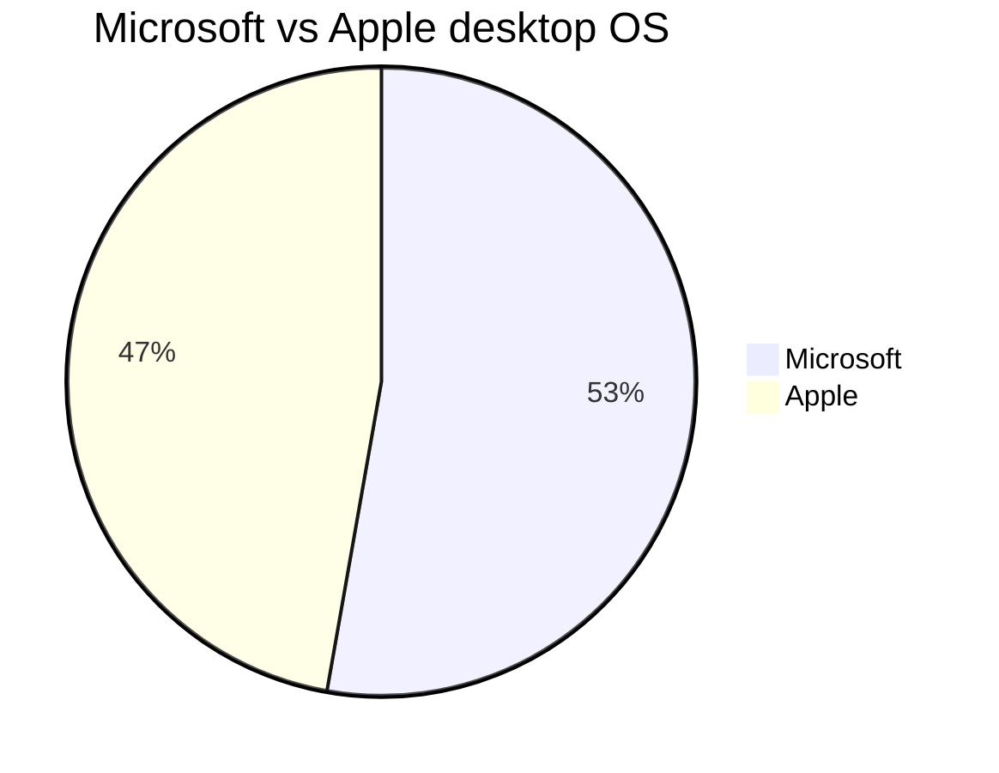

## Opening Statement

I rely on destop operating system for work and my day-to-day tasks.

## Windows and Apple Desktop Operating System Versions I Have Used

In the order of which I was introduced:

| No. | Name | Codename | Est. Duration
|---|---|---|---|
| 1. | MS-DOS 7 | | 4-5y (1995-1999)
| 2. | Windows 95 | Chicago | 6-7y (1995-2001)
| 3. | Windows 98 | Memphis | 2-3y (1999-2001)
| 4. | Windows XP | Whistler | 5-6y (2001-2006)
| 5. | OSX 10.3 | Panther | <1y (2004)
| 6. | Windows XP x64 | Anvil | 3-4y (2006-2009)
| 7. | Windows Vista | Longhorn | <1y (2007)
| 8. | OSX 10.5 | Leopard | <1y (2008)
| 9. | OSX 10.6 | Snow Leopard | 4-5y (2008-2012)
| 10. | Windows 7 | | 5-6y (2009-2014)
| 11. | Windows 8 | | <1y (2012)
| 12. | OSX 10.10 | Yosemite | 1y (2014)
| 13. | OSX 10.11 | El Capitan | 1y (2015)
| 14. | macOS 10.12 | Sierra | 1y (2016)
| 15. | macOS 10.13 | High Sierra | 1y (2017)
| 16. | macOS 10.14 | Mojave | 1y (2018)
| 17. | macOS 10.15 | Catalina | 1y (2019)
| 18. | macOS 11 | Big Sur | 1y (2020)
| 19. | macOS 12 | Monterey| 1y (2021-2024)
| 20. | Windows 11 | Sun Valley 2 | <1y (2024)

The table and chart above shows that I am desktop OS agnostic. However, there are notable pros and cons of each OS that I want to highlight.

Comparing the pros and cons of Windows OS and macOS over the past 20 years reveals how each system has evolved and catered to different user needs and preferences. Here's a detailed look.

## Windows OS

### Pros
1. Hardware Compatibility
2. Software Availability
3. Customization Options
4. Backward Compatibility
5. Gaming

### Cons
1. Security Vulnerabilities
2. System Stability
3. License Costs

## macOS

### Pros
1. User Experience
2. User Interface
3. Quality of Applications optimized for macOS
4. Security
5. Integration with Apple Ecosystem
6. Stability and Performance

### Cons
1. High Initial Cost
2. Limited Customization

Limited software availability and gaming used to be an issue. However as more people develop softwares on macOS, open source support also increqsed. The Hackintosh project also open doors for hardware options.

## Other Notable Mentions

### Linux

I first stumbled upon Linux sometime around the year 2000. I have tried various flavours of Linux distros, however none seems to fit my overall needs. That being said, if I have to switch to Linux for my daily driver, I bet I can survive! Tho I would prefer to use stable distros such as Ubuntu or Fedora, I am also keen to try the likes of [ElementaryOS](https://elementary.io) or [Pop!_OS](https://pop.system76.com). Or settle with Arch. 

## ChromeOS

This is actually the dream, minus the bloat codes from Google.

## Which One Should I Choose?

According to ChatGPT:

**Windows OS** has evolved to offer extensive hardware and software compatibility, making it ideal for a wide range of users, from gamers to enterprise professionals. However, it is more susceptible to security threats and system instability due to its open nature.

**macOS** provides a premium, stable, and secure user experience with deep integration into the Apple ecosystem, making it a preferred choice for creative professionals and users who value seamless device interoperability. The main drawbacks are its high cost and limited hardware and software customization options.

If you still can't decide, ring me up!
