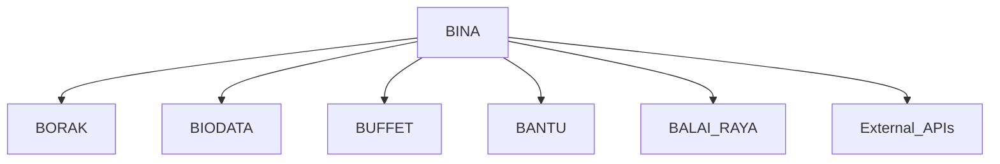
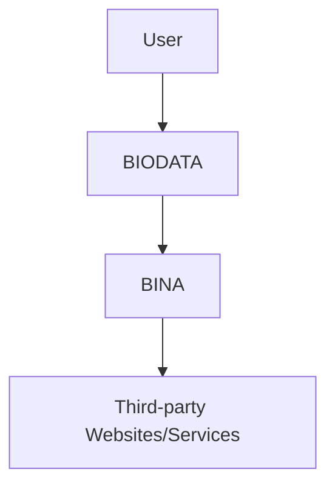
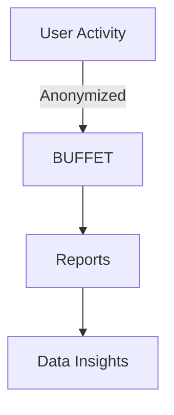
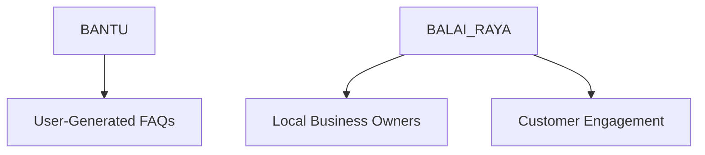
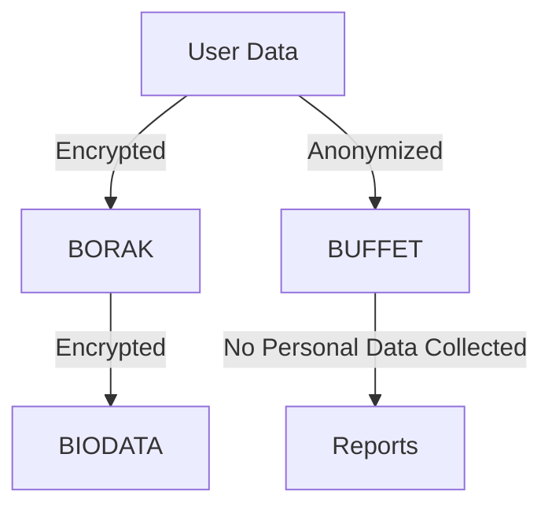

## Executive Summary

This proposal outlines a modular and privacy-first digital communication framework specifically designed for Malaysia. As concerns over data privacy, digital sovereignty, and the inefficiencies of monolithic communication platforms grow (think of Google's parent company Alphabet and Facebook, Instagram and WhatsApp's parent company Meta), there is a clear need for a system that can cater to Malaysia's unique digital landscape. This framework offers modularity, privacy protection, and flexibility through services such as API Service, Messaging, Digital Identity, Analytics, Support Documentation, and Community Platforms. These services prioritize privacy, promote local sovereignty, and are cost-effective for individuals, businesses, and government sectors alike.

The framework also aligns with the goals of **Malaysia Digital Economy Blueprint (MyDIGITAL)** by promoting inclusivity, ensuring security, and fostering digital growth. This modular approach allows for scalability and customization, empowering users to build the services they need while keeping control over their data.

---

## Introduction

### The Digital Landscape in Malaysia

Malaysia is experiencing rapid growth in its digital economy. However, with this growth comes significant challenges, especially in the areas of data privacy and digital sovereignty. Malaysia’s **Personal Data Protection Act (PDPA)** has put some safeguards in place, but reliance on foreign-owned platforms often leads to data being stored and processed outside of the country, raising privacy concerns.

Many existing communication solutions either lack the flexibility needed for diverse users or pose risks in terms of data security. A solution that prioritizes privacy, modularity, and localization is needed to meet Malaysia’s specific requirements while contributing to the goals of the **MyDIGITAL** initiative.

This proposal presents a comprehensive digital communication framework that emphasizes:
- **Data sovereignty** through locally hosted and managed solutions.
- **Privacy-first principles** embedded in the architecture.
- **Modularity** to allow organizations and individuals to customize their communication tools.

---

## System Architecture

### Key Components

#### **BINA (API Service)**

At the heart of the architecture is **BINA**, the API service that connects all modules seamlessly. **BINA** serves as the backbone for communication between the framework's various services. It allows for easy integration with existing systems in both the private and public sectors. 

Potential applications include:
- **E-Government services** where Malaysians can use their unified identity to access different government portals with single sign-on.
- **Enterprise collaboration**, where organizations can integrate multiple APIs for cross-departmental use.

**BINA** also ensures scalability, as more modules or external APIs can be connected without causing disruptions to existing workflows.

#### **BORAK (Messaging Service)**

**BORAK** is the secure communication service built on top of **Signal** and **Telegram** protocols. These platforms are known for their **end-to-end encryption** capabilities, ensuring that messages remain secure and private. The decision to use these open platforms allows for customization while maintaining high-security standards.

Examples of potential applications:
- **Disaster management** communication, where emergency services can rely on encrypted, real-time messaging.
- **Business communications**, especially for enterprises requiring privacy in their internal communications.

BORAK can be customized for Malaysian users, incorporating local languages and providing white-labeled solutions for businesses or government agencies.

#### **BIODATA (Personal Identity Service)**

The **BIODATA** service provides a unified identity management system, allowing for single sign-on (SSO) across multiple platforms. This ensures user convenience, security, and reduced friction in accessing various services.

For example:
- A user can log into their bank, healthcare provider, and government services with a single **BIODATA** account, simplifying processes while maintaining a high level of security.
  
With **SSO**, businesses can reduce the risk of **password fatigue** and minimize security vulnerabilities caused by multiple credential sets.

#### **BUFFET (Analytics Service)**

**BUFFET** offers privacy-centric analytics powered by **Plausible** and **Matomo**. Unlike traditional services like Google Analytics, **BUFFET** prioritizes anonymity by not tracking users via invasive cookies or IP addresses. This makes it an excellent solution for organizations that want data-driven insights without compromising user privacy.

Potential applications include:
- **Online education**, where educators can track student's engagement without violating their privacy.
- **Healthcare**, where hospitals can monitor user interactions on digital platforms without collecting sensitive patient information.

#### **BANTU (Support Documentation)** and **BALAI RAYA (Community Platform)**

**BANTU** provides an easy-to-use documentation platform for support, enabling users to troubleshoot issues or learn how to use various services. **BALAI RAYA** acts as a community platform, fostering interaction between local businesses, government agencies, and general Malaysians.

Example use cases:
- A small business can use **BALAI RAYA** to create a forum for customer engagement.
- Local communities can interact, share resources, and troubleshoot issues together.

---

## Data Sovereignty and Privacy Considerations

Malaysia's **PDPA** protects individuals' personal data from being misused. However, many Malaysians continue to use foreign platforms, which often store data abroad, raising concerns over sovereignty and security. 

Our framework addresses these concerns by:
- **Hosting data locally** to comply with national laws.
- Ensuring all communications within **BORAK** are protected by **end-to-end encryption**, guaranteeing that no unauthorized entities can intercept communications.
- Employing **BUFFET** analytics that anonymizes all user interactions, ensuring full compliance with privacy laws.

Countries like **Germany** and **Brazil** have adopted similar privacy-first approaches by enforcing strict data localization and privacy standards. Malaysia can follow suit by building out its digital sovereignty through a system like this.

---

## Pricing Model

### Subscription Tiers
We propose three pricing tiers:

1. **Basic Subscription**: For individual users or small communities. This tier would allow for basic access to **BORAK**, **BIODATA**, and limited use of **BUFFET**.
2. **Full-Featured Subscription**: For small-to-medium businesses requiring full access to all services.
3. **Enterprise Subscription**: For large organizations with a need for custom solutions and dedicated SLAs.

### Comparison with Other Services
When compared to alternatives such as Slack or Google Workspace, this pricing model offers a **more affordable and privacy-focused alternative**. Additionally, our community-driven approach allows users to contribute financially or through open-source development, ensuring a sustainable ecosystem.

---

## Why This Architecture Works

### Scalability and Flexibility

The modular design of the framework allows for:
- **Horizontal scaling** where additional **BORAK** servers or **BUFFET** instances can be added to manage larger loads.
- **Custom module selection**, enabling users to pick the services they need without paying for unnecessary features.

This design offers flexibility to organizations of all sizes, ensuring it can grow alongside the digital needs of Malaysia.

### Localization Capabilities

Our framework supports Malaysia’s multilingual environment by providing localized language support for Malay, Mandarin, and Tamil. This localization enables the platform to cater to diverse communities and ensures inclusivity. More local languages and dialects can be progressively added in the future. 

For instance, **BALAI RAYA** could be used by community groups to provide localized support and discussions in their native languages, while a translation feature can help bridge the language barrier and allow other Malaysians to offer aid when necessary.  

---

## Conclusion and Future Roadmap

The framework laid out in this proposal addresses Malaysia’s growing need for a privacy-first, locally-hosted digital communication system. As digital needs evolve, our roadmap includes:
- Incorporating **AI-driven insights** into **BUFFET** for smarter analytics.
- Expanding **BIODATA** into a national identity management platform.
- Collaborating with universities and businesses to continuously improve and add new features.

Our vision is for Malaysia to lead Southeast Asia in digital sovereignty and privacy-first technology development. This framework can easily be replicated and assimilated into any community of any size, as proven by Meta's business model. If Meta boleh, Malaysia pun boleh!

---

## Appendix

### Glossary
- **SSO**: Single Sign-On.
- **PDPA**: Personal Data Protection Act.
- **SLA**: Service Level Agreement.

### Additional Resources
- **Malaysia PDPA**: https://www.pdpa.gov.my
- **Plausible Analytics**: https://plausible.io
- **Matomo Analytics**: https://matomo.org
